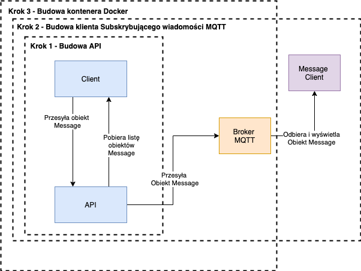

# SEBN-MES-StratProject-Test1

Ten projekt jest przeznaczony dla studentów AJP, którzy biorą udział w projekcie MES dla SEBN.

## Opis zadania omówionego na spotkaniu

### Krok-1 - Budowa API

Ten krok powinien składać się z dwóch elementów:

1. API - applicaja WebAPI, która udostępnia dwie metody REST w kontrolerze:
   1. SendMessage - POST pobieracjacy obiekt **Message** do przesłania
   2. GetMessages - GET zwracający wszystkie przesłane obiekty typu **Message**.
   
   Po każdej operacji Send Message API powinno zapisać wiadomość w jakimś lokalnym pliku, w takiej formie aby później można było pobrać listę historycznych wiadomości.

   Przy tworzeniu lokalnego zapisu warto uwzględnić optymalizację procesu zapisu i odczytu pliku tak aby było ich jak najmniej. Aby uniknąć blokowania pliku do zapisu/odczytu.
   
2. Client - To powinna być aplikacja Blazor Webassembly, która ma dwie podstrony
   1. Wyślij wiadomość - wywołuje akcję Send Message
   2. Pokaż wiadomości - pokazuje wszystkie wiadomości w formie tabeli w porządku malejącym od najstarszej do najświeższej. Dodatkowo Powinna być możliwość wyszukania wiadomości o określonej treści.

System posługuje się obiektem **Message** Który ma następujące właściowści:
- ID - tekstowa reprezentacja unikalnej wartościu typu GUID,
- Data - data utworzenia wiadomości, typu DateTime, nadawana po stronie serwera w momencie utworzenia waidomości
- Tresc - treść wiadomości.

### Krok 2 - Budowa klienta subkrybującego wiadomości MQTT.

W tym kroku dodajemy instancję brokera MQTT (mosquito na przykład) i w czasie Wykonania operacji API przesyła obiekt **Message** do brokera MQTT do topicku o nazwie **NewMessages**.

Następnie budowany jest klient, który subskrybuje topick **NewMessages** i gdy tylko pojawi się tam nowa wiadomość umieszcza ją na widoku liście wiadomości.

Klient powinien byś aplikacją WPF lub Xamarin, a subskrypcja wiadomości powinna odbywać się w oddzielnym od interfejsu wątku, tak aby cały czas apliakcja była responsywna dla użytkownika.

### Krok 3 - Budowa kontenera Docker.

W tym kroku dodajemy definicję pliku Dockerfile dla API i Klienta, następnie tworzymy plik docker-compose, który zbuduje i uruchomi następujące usługi
- api
- client
- serwer mosquito

Każda z tych usług powinna udostęniać port, a klient dodatkowo volume, na którym będzie zapisywany plik z wiadomościami, tak aby nie zniknęły pomiędzy kolejnymi uruchomieniami.

## Dyskusja i przekazanie projektu

Dyskusja ogólna na temat projektu może odbywać się w tym repozytorium [pod tym linkiem](https://github.com/goluda/SEBN-MES-StratProject-Test1/issues/1) 

Każdy z uczestników projekt stworzy swoje własne repozytorium dla swojego kodu i przekaże link do sprawdzenia kodu